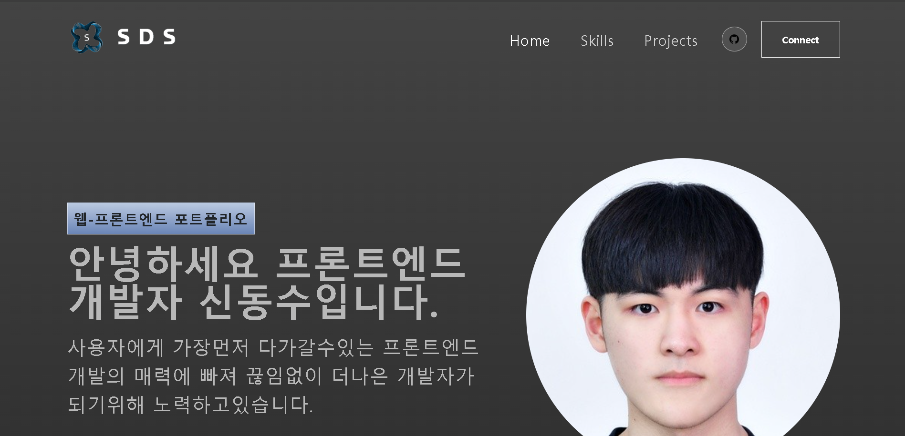

# 🐣 Portfolio

**🚀 배포 링크**: [PROTFOLIO 바로가기](https://luxury-vacherin-425521.netlify.app/)

React를 이용하여 나만의 포트폴리오를 만들어본 앱입니다.

 
   
 

## 컴포넌트

- Banner(가장먼저 보이는 메인 컴포넌트)
- NavBar(헤더 컴포넌트)
- ProjectCard(프로젝트 카드의 요소를 관리하는 컴포넌트)
- Projects(전체 프로젝트 배열을 관리하는 컴포넌트)
- Skills(스킬의 퍼센트를 관리하는 컴포넌트)

 

## 주요 기능

- 헤더의 스크롤 반응에따라 크기 색상등 변경
- 스킬컴포넌트로 스킬을 추가및 관리
- 프로젝트 배열로 각 항목별로 배열 관리

 
